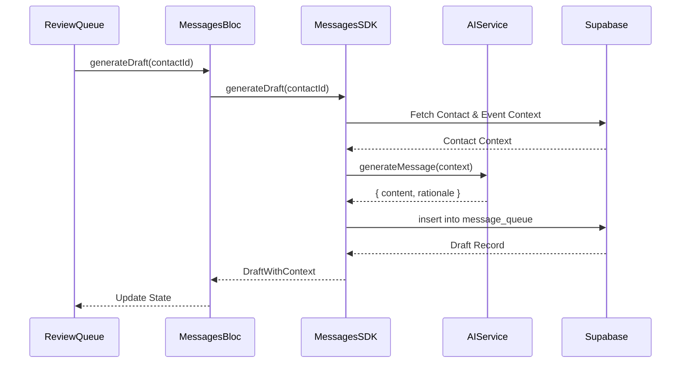

# SocialSync Architecture Documentation

## 1. System Overview

SocialSync is a React-based Progressive Web App (PWA) designed to manage relationships through "High-Touch" interactions. It uses a **BLoC (Business Logic Component)** pattern to separate UI from business logic and communicates with Supabase data through a dedicated **SDK Layer**.

```mermaid
graph TD
    User[User Interface] --> BLoC[BLoC Layer (Hooks)]
    BLoC --> SDK[SDK Layer (Static Classes)]
    SDK --> Supabase[Supabase Client]

    subgraph "Frontend Architecture"
        UI[Components / Pages]
        BLoC
        SDK
        Utils[Utilities / Helpers]
    end

    subgraph "Backend"
        Supabase
        DB[(Postgres DB)]
        Realtime[Realtime Service]
    end

    Supabase --> DB
    Supabase --> Realtime
    Realtime -.-> BLoC
```

## 2. State Management (BLoC Pattern)

We use the **BLoC (Business Logic Component)** pattern adapted for React custom hooks. This ensures that:

- **UI Components** are purely presentational.
- **Business Logic** is isolated in hooks (e.g., `useContacts`).
- **State** is managed locally within the BLoC or via Context if shared.

### Example Flow: Creating a Contact

1. `ContactForm` calls `createContact` from `useContacts` hook.
2. `useContacts` sets `isLoading` state.
3. `useContacts` calls `ContactsSDK.createContact(data)`.
4. `ContactsSDK` transforms data and calls `supabase.from('contacts').insert(...)`.
5. `ContactsSDK` returns a standardized `SDKResponse`.
6. `useContacts` updates local state or handles errors based on `SDKResponse`.

## 3. SDK Layer Design

The SDK layer consists of static classes that act as the **sole entry point** for all backend interactions.

**Key Responsibilities:**

- **Data Mapping**: Transforming Snake_case (DB) <-> CamelCase (Frontend).
- **Error Handling**: Catching Supabase errors and returning standardized result objects.
- **Telemetry**: Logging all API calls for performance monitoring.
- **Business Calculations**: Applying logic like `healthScore` calculation on fetch.

## 4. AI Integration Flow

The AI Message System uses a template-based service (simulation for v1) to generate context-aware message drafts.



## 5. Directory Structure

```
src/
├── blob/           # Business Logic Components (Custom Hooks)
│   ├── contacts/
│   ├── events/
│   └── messages/
├── components/     # UI Components
│   ├── forms/
│   ├── ui/         # Generic UI (Buttons, Cards)
│   └── ...
├── services/       # SDK Layer & External Services
│   ├── contactsSDK.ts
│   ├── eventsSDK.ts
│   ├── messagesSDK.ts
│   └── ai.service.ts
├── types/          # TypeScript Definitions
└── utils/          # Helper Functions (Math, Date, etc.)
```
